# Olá! Eu sou o Guilherme Estevam 👋

**Desenvolvedor Full Stack** · Laravel & Vue.js · Guarulhos, SP  
Formado em Análise e Desenvolvimento de Sistemas · +6 anos na área de tecnologia

---

### Sobre mim

Desenvolvo aplicações web com foco em experiências claras e sistemas que realmente resolvem o dia a dia.  
Vim do suporte de TI e levo essa visão operacional para o código — do backend ao frontend.

- 🔭 Trabalhando com **Laravel**, **Vue.js** e **MySQL**
- 🌱 Explorando interfaces modernas com **Inertia.js** e **Vue 3**
- 💬 Aberto a vagas **CLT**, projetos **PJ** e conversas sobre desenvolvimento web
- 📍 Guarulhos, SP · Remoto
- 🌐 Portfólio: [guiestevam.me](https://guiestevam.me/)

---

### Tecnologias

  

---

### Projetos em destaque

Projetos comerciais em produção (repositórios privados). Demos no ar:

| Projeto | Descrição | Stack | Demo |
| --- | --- | --- | --- |
| [**SkyFashion**](https://skyfashion.pt/) | E-commerce de moda — catálogo, categorias, carrinho e painel admin para operação web 24/7 | Laravel · Livewire · MySQL | [Site](https://skyfashion.pt/) |
| [**Nerdola Miner**](https://nerdolaminer.com.br/) | E-commerce de ASICs e acessórios de mineração, com checkout e calculadoras de rentabilidade | Laravel · Livewire · MySQL | [Site](https://nerdolaminer.com.br/) |
| [**LGF Contabilidade**](https://lgfcontabilidade.com.br/) | Landing de conversão para escritório contábil, com SEO local e captura de leads PJ | HTML · CSS · JavaScript · Vite | [Site](https://lgfcontabilidade.com.br/) |
| [**Transcende**](https://transcende.vercel.app/) | Web app para estúdio de yoga e terapias — serviços, presença digital e reservas | HTML · CSS · JavaScript | [Site](https://transcende.vercel.app/) |

Também mantenho projetos open source como [SyncFinance](https://github.com/GuiEstevam/SyncFinance), [Guicodex](https://github.com/GuiEstevam/Guicodex) e [Horientando](https://github.com/GuiEstevam/Horientando).

---

### GitHub Stats

  
  

---

### Onde me encontrar

---

  <picture>
    <source media="(prefers-color-scheme: dark)" srcset="https://raw.githubusercontent.com/GuiEstevam/GuiEstevam/output/github-contribution-grid-snake-dark.svg" />
    <source media="(prefers-color-scheme: light)" srcset="https://raw.githubusercontent.com/GuiEstevam/GuiEstevam/output/github-contribution-grid-snake.svg" />
    
  </picture>

